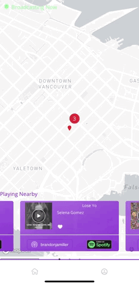

# ListenIn

.....

.....

## About the Project

Have you ever been on the bus, or in the gym listening to music through your headphones?
Have you ever looked around and saw other people listening through their headphones as well?
Have you ever wondered what they are listening to?

If you answered yes to all of the above questions, this app is for you!

ListenIn is a mobile-first web application that allows users to connect their Spotify account and view what other users in their area (within 1km radius) are listening to. Users can preview others' songs, listen to them in their own Spotify app, and save them for later in their personalized track pocket.

## Tech Stack

- Ruby on Rails
- React
- PostgreSQL
- SCSS
- Spotify API
- Mapbox
## Getting Started
First, fork this repo so you get your own copy of it. Once you have done that, you can clone your new repo to your machine, and get started.

You will need to create a Spotify developer id and secret key which will be placed in the rails backend.

You need **TWO** terminals for this.

In one terminal, run `bundle` to install the dependencies. Run `bin/rake db:setup` to create the databases (called rails_project_development by default). Run `bin/rails s` to run the server.

In the other terminal, `cd` into `client`. Run `npm install`. Rename the `.env.example` file to be called `.env`. Then run `npm start` and go to `localhost:3000` in your browser.

## Contact Us!
[Julia Jachimowicz](https://github.com/juliaj621)
 
[Brandon Miller](https://github.com/Bjam091)
 
[Anne Franklin](https://github.com/anmerfrank)
